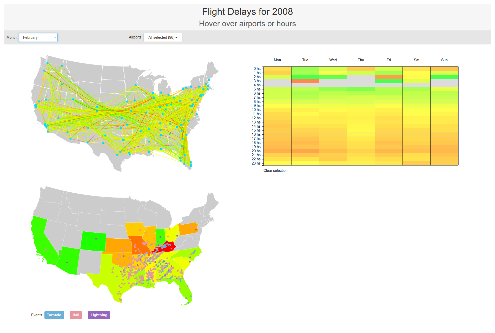
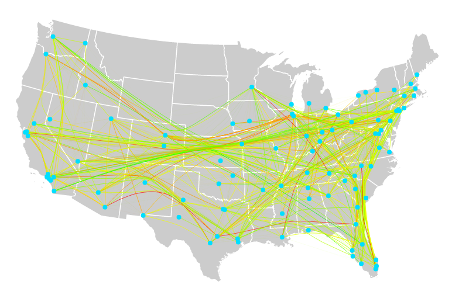
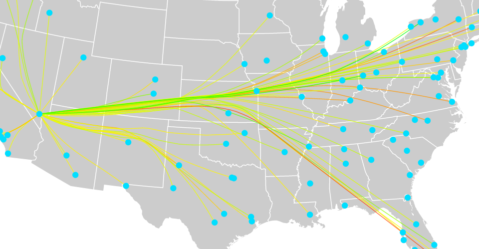
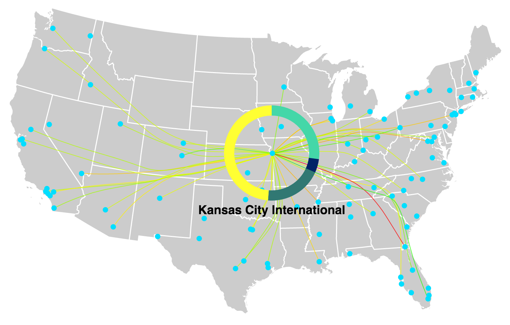
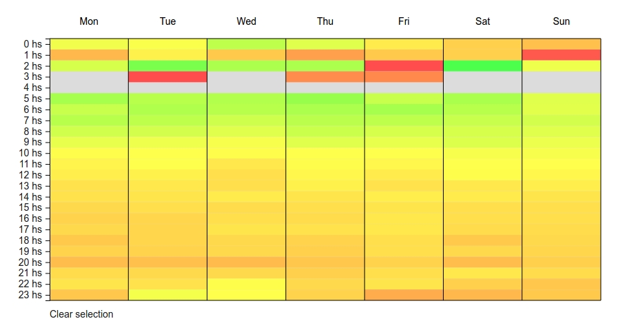
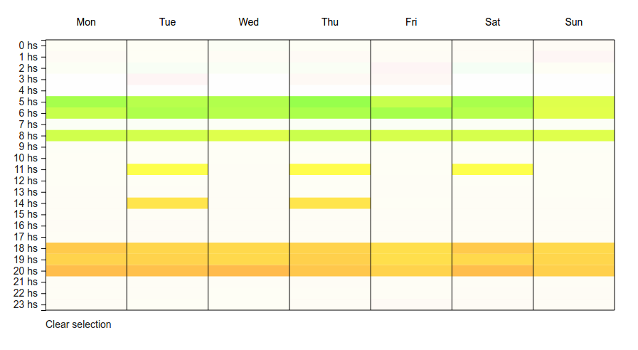

# CS 424 Fall 2016 - Visualization & Visual Analytics 1 
## Project 2

### Students
* [Federico Ruiz](https://github.com/fedex995)
* [Nicolas Burroni](https://github.com/nburroni)

### The Data
For this project we chose to show flight delays for domestic flights in the US in the year 2008, filtered by month.
### Dataset Type
The data represents a network of flights, where the nodes represent the origin and destination airports, while the edges represent the flight itself. We combined this with geometrical data, using the latitude and longitude of the airports to place them in the map. 
We also derived the data into a table for the week visualization, where the rows represent the time of the day and the columns stand for the day of the week. 
#### Motivation & Audience
With each passing year, flights are becoming more and more important in people's lives. Whether it is for business or pleasure, people depend on them to be on time, and delays generally cause inconvenience and discomfort in airline users. By visualizing these delays from different perspectives, we hope to find patterns and possible reasons for the occurrance of these delays, and ideally help towards finding a solution.

We wanted to create a visualization dashboard that would allow airline passengers to get a sense of when and under what conditions it may be best to take a flight, looking at the delays these suffer. We intend to answer questions such as: 
* "Should I expect more delays on a 5pm flight than on an 8am flight?"
* "There is lightning near my origin airport. Will my flight probably get delayed?"
* "Do flights on this route generally have big delays?".

#### Datasets
We used three different datasets for this project. The datasets were so large that we had to filter them 
##### [Airline on-time performance](http://stat-computing.org/dataexpo/2009/the-data.html)
This dataset provided all of the domestic flights for the year 2008, and included the following:
> Year, Month, DayofMonth, DayOfWeek, CRSDepTime, CRSArrTime, FlightNum, TailNum, ActualElapsedTime, ArrDelay, DepDelay, Origin, Dest, Cancelled, CarrierDelay, WeatherDelay, NASDelay, SecurityDelay, LateAircraftDelay

##### [Supplemental airport data](http://stat-computing.org/dataexpo/2009/supplemental-data.html)
This dataset provided extra information about US airports, which we referenced by their iata code.

airports.csv describes the locations of US airports, with the fields:
> iata (the international airport abbreviation code), name of the airport, city and country in which airport is located, the latitude and longitude of the airport

##### [Supplemental weather data](https://www.ncdc.noaa.gov/swdi/csv.html)
We used NOAA's Severe Weather Data Inventory to map weather events during 2008 to the weather-related delays indicated in the first dataset, in order to try to find some correlation between the two. This dataset included the following:
> BEGIN_YEARMONTH, BEGIN_DAY, BEGIN_TIME, END_YEARMONTH, END_DAY, END_TIME, EPISODE_ID, EVENT_ID, STATE, STATE_FIPS, YEAR, MONTH_NAME, EVENT_TYPE, county, lat, lon

### The Visualizations


#### [Click to watch video](https://www.youtube.com/watch?v=jEJiiYTUw6U)
[](https://www.youtube.com/watch?v=jEJiiYTUw6U)

#### Inspiration
[Force‐Directed Edge Bundling for Graph Visualization](http://onlinelibrary.wiley.com/doi/10.1111/j.1467-8659.2009.01450.x/full)
> Holten, Danny, and Jarke J. Van Wijk. "Force‐Directed Edge Bundling for Graph Visualization." Computer graphics forum. Vol. 28. No. 3. Blackwell Publishing Ltd, 2009.

We based one of our visualizations on this edge bundling technique. It helped reduce cluttering of the many thousands of edges we obtained with the chosen datasets. Nevertheless, filtering by the user is still required to get a more detailed view. This edge bundling technique also provides a good way to visualize high-level patterns in the data, such as traffic and general delays between areas or clusters of airports.

#### Link-node Map
This map can provide a high-level overview of flight delays


The user can zoom in to see the edges and nodes with more detail


The user can click on a node to get information about the amount and specific types of delays that airport suffers from


#### Week Heat Map
The week visualization allows the user to view the average delays per hour per day


The user can click on whole hours or specific hours in a day to compare the selected values


*Greyed out areas are hours for which there were no flights*

#### Weather Heat Map
The user can discover correlations between climatic events and the amount of delay in airports due to weather conditions. This information is divided in states, where the dots indicate the different type of weather events distinguished by their colors, and the states, which are also divided by colors, depending on the total amount of delayed they experienced.

#### Visualization Tasks
##### Analyze
Our visualization achieves the task of analyzing the data. More in particular, the user can consume the data shown in the visualizations. This data already existed, but it was processed so the user can discover, present or enjoy. He/she may be interested in showing people the actual panorama of flight delays, or it may be in his/her interest to analyze the data in order to know more about a yet not understood aspect of flight itineraries. 
##### Discover
Users can discover new information, mainly through the week and weather visualizations. For example, if wanting to prove a theory which states that flights in the afternoon usually get more delays, the week visualization would help to discover that that theory is true.
##### Present
A user may want to present to others something already known. For example, using the link map visualization, the user may present to others all the connections between cities. It’s important to say that in this case, the knowledge communicated is already known by the recipient. Interaction is also important while presenting the data. The user may hover over an airport in order to emphasize on the links of that particular airport.
##### Enjoy
Users that don’t form part of the target audience can enjoy the visualization. Many people, although they don’t have any discovering or presenting purpose while using the vis, can use it simply to learn about the US flight system, or just play around with the flights. 
##### Lookup
This task may be one of the most influential in our visualizations. If a user already knows which airport he/she wants to look into, they just have to remember where it is located geographically, and will get all the delay information from there.
##### Derive
In order to make the week visualization, we had to go over some transformations over the dataset. We went from a list of flights to the delays depending of the hour and the day of the week. This shows a clear derivation from the original data. The same can be seen in the weather visualization, where the average weather delay was calculated using the list of flights, and then displayed using a color scale.
##### Browse
In other cases, the user doesn’t know exactly what he/she wants. Keeping up with the last example, the user may use the airport filter in order to see in the map only the selected airports. 
##### Compare
By selecting different month options, the user can compare between them. This has only one disadvantage, and is the fact that the two visualizations can’t be seen simultaneously. The user can also compare delays and weather events by hovering on the week’s visualization hours. This also gives the ability to compare between different times of the day, and also between different days of the week. 
Another clear example of comparison can be seen in the weather visualization. Here, the user can compare the relation between weather events like tornadoes or lightning, and the delay airports experience at the same time. 
##### Summarize
These visualizations include highly dense data-sets, so we had to make sure that we didn’t go too specific in the data we were showing, in order to grant the user the possibility to give an overview of the situation. This is why we made averages of the data monthly, so the user can get general insight for every month. Nevertheless, we left friendly interactions for the user to quickly filter the data shown and get more detailed results.
#### Interactive Techniques
##### Animation
We include animations on load and when the user hovers or clicks on items to provide a smooth experience
##### Select Elements
The user may select airports or different hours to visualize those selected in specific. Hovering also removes clutter and focuses the view on what the user is hovering over by highlighting related items.
##### Navigate
The user can zoom and pan the map visualizations to provide greater detail. The user is unconstrained as in they can zoom and pan freely on the maps.


### How To Run
#### 1. Download the project source code
Either clone the project, or download it manually and extract it.

#### 2. Open a Terminal and run your favorite server
We developed this project using python's server functionality, so for best results we recommend using the same.
```bash
$ cd /path/to/source-code
$ python -m SimpleHTTPServer <port>
```

#### 3. Fire up Chrome (yes, please use Chrome)
We kindly ask for you to use Chrome, which is what we used while developing, and where we got the best results. Open it, and navigate to `http://localhost:<port>/`

#### 4. You're all set!
You can now explore the visualization dashboard.

### Who Did What
* [Federico Ruiz](https://github.com/fedex995)
  * Initial dataset compression and cleanup. Calculation of top airports and removal of bad data.
  * Link-node Map: Interaction; node hover and click, airport delay circle.
  * Weather Heat Map. Visualization.
  * Visualization and filters integration.

* [Nicolas Burroni](https://github.com/nburroni)
  * Project structure, visualization class structure.
  * Data loading, data mapping for visualization algorithms. Data filters.
  * Link-node Map: Rendering; map drawing, node placement, edge rendering with force-directed edge bundling.
  * Week Heat Map. Visualization and interaction between week heat map and map visualizations.
  * Visualization and filters integration.
